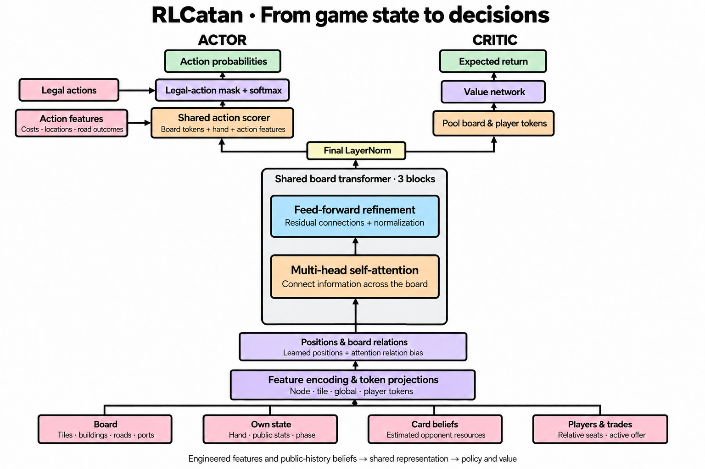

# Learning to play Catan

The difficult part of learning Catan is that a useful move rarely has an
immediate payoff. A road might secure a settlement several turns later, a port
might compensate for an otherwise unbalanced economy, and a trade might help
another player more than it helps us. The agent needs to connect these choices
to the position as a whole, while reasoning from incomplete information.

This project explores how much of that problem we can handle with a compact
representation and a standard reinforcement-learning algorithm. The design is
inspired by [Settlers-RL](https://settlers-rl.github.io/), but makes different
choices about where to put domain knowledge and how to represent actions.
The following describes those choices and their limitations, rather than a
catalog of trained checkpoints.

*Read from bottom to top. The diagram includes the player and trade inputs used
when learning multiplayer games with negotiation.*

## What should the agent observe?

Consider choosing an opening settlement. Its value depends on the resources it
produces, how often they arrive, and what the rest of our position can produce.
A picture conveys both this information and the board's geometry. We represent
them through numerical features for tiles, buildings, roads, ports, and the
player's hand, organized into tokens. Learned positional embeddings and
attention biases encode location and adjacency, helping the transformer connect
local opportunities to the wider board.

We also calculate some useful quantities directly. Expected production tells
the agent about dice probabilities; robber-adjusted production describes what
is currently blocked; candidate-road features describe the resulting road length
and whether it would claim longest road. These features let learning focus on
how to use those facts. They also impose a bias: this is a deliberately
featurized approach, and its success would not demonstrate that the network
learned every rule or useful concept from scratch.

[Settlers-RL also uses structured features](https://settlers-rl.github.io/),
including production information. Our additional action-specific calculations
make more consequences explicit before the policy scores a move.

## What can we know about another player's hand?

Suppose a roll gives an opponent two ore, and they later buy a development card.
We can update our estimate of their hand without seeing their cards. A theft or
hidden discard makes that estimate less certain. Throwing away this history
would leave the agent with less information than an attentive human player.

Our environment maintains a small tracker for each observer. It combines cards
known to be held with an uncertain pool and an estimated resource mix. The
network receives this summary alongside public player information. It does not
receive opponents' actual hands or hidden victory-point cards.

[Settlers-RL tracks minimum and maximum resource counts](https://settlers-rl.github.io/);
we provide expected counts and uncertainty. Neither uses a recurrent observation
encoder; the reference removed its experimental LSTM.

The benefit is a compact input without recurrent training. The cost is that
our tracker decides which history survives. It is an approximate belief, not
a full distribution over possible hands or a learned model of an opponent's
intentions. Its updates and the legal-action masks must respect the same
information boundary as the observations.

## How should the board fit together?

An attractive location can be a poor choice if it produces more of a resource
we already have and leaves us dependent on trading for everything else. This
is why the network needs more than a separate score for each intersection.

We turn intersections, tiles, game context, and players into tokens: learned
vectors that describe different parts of the position. Attention allows each
token to gather information from the others. Board relations indicate which
locations are adjacent or touch the same tile, while learned positions preserve
location identity. Player tokens use turn order relative to the acting player,
with absent seats masked out.

[Settlers-RL attends over tiles and development cards in separate modules,
then combines their outputs with player features](https://settlers-rl.github.io/).
We put board and player tokens through a shared transformer.

This allows information about opponents and the board to interact throughout
the encoder. It also puts more work into designing compatible token features.
We use a small attention stack with residual connections and normalization;
there is no evidence here that making it deeper would automatically improve
play. Attention can connect relevant facts, but does not itself simulate the
future consequences of a plan.

## How should the agent choose an action?

Catan's actions have different shapes. A road needs two endpoints, a robber
move needs a tile and possibly a victim, and an exchange needs resources to
pay and receive. The representation should let similar choices share what
the agent learns.

[Settlers-RL constructs actions through conditional heads for type, location,
resources, and other arguments, including recurrent trade composition](https://settlers-rl.github.io/).
We score a fixed table of complete candidate actions with one shared network.

For each candidate, the scorer receives the relevant board tokens, the player's
hand, and features describing the action. Two roads therefore use the same
scoring rule with different endpoints. Two exchanges use the same rule with
different resource changes. Although the final output is a categorical
distribution over the table, its entries do not have unrelated scoring networks.

This keeps action selection straightforward, but enumeration has a ceiling.
Our negotiation space uses a restricted set of small resource exchanges;
arbitrary bundles would make the table much larger. Conditional action heads
would become more attractive as the number of combinations grows. The shared
scorer is a practical choice for the action space we actually support, not a
claim that enumeration is always preferable.

Both approaches mask illegal actions before selection. The agent still has to
learn which legal choice is useful; it simply does not waste exploration on
moves the game cannot execute.

## Where does the learning signal come from?

Winning is the objective, but waiting until the end of every game provides
little guidance about the many choices along the way. The actor selects actions;
the critic pools the shared representation to estimate future return. PPO uses
that estimate to judge whether outcomes were better or worse than expected.

[Settlers-RL supplements winning with rewards for individual game events](https://settlers-rl.github.io/).
Our shaping instead rewards discounted changes in a potential based on victory
progress and resource income.

The distinction matters when an activity can be repeated. We want feedback for
improving a position, rather than a bonus merely for taking another action.
Income in the potential ignores the robber, so moving it cannot by itself
inflate that measure. This is a safeguard against an avoidable reward shortcut,
not proof that all strategies favored by the reward are good Catan strategies.

True terminal states zero the potential; time limits retain it for bootstrapping.
We report capped games separately rather than treating them as losses. Forced
actions are folded into transitions to the next choice, so the discount applies
to decision transitions rather than every engine action. These details affect
what the critic learns, and its output should not be read directly as a win
probability.

## Who should the agent learn against?

An opponent is part of the training problem. If a policy only faces a player
who accepts poor trades, it can improve its training reward without learning
to negotiate well against anyone else.

[Settlers-RL samples earlier policies with a preference for recent versions](https://settlers-rl.github.io/).
Our league combines scripted strategies and frozen policies, weighting members
more heavily when the learner struggles against them.

Keeping a mixture gives the learner different economies, expansion patterns,
and responses to trades. It does not guarantee broad competence: the league
can still have shared weaknesses. Only the active learner's experience enters
its PPO update; frozen opponents provide the competition.

The training path also includes distillation from an earlier policy, followed
by PPO and staged representation expansions for counting, multiple players,
and negotiation. Transferring weights reuses earlier learning, but adding tokens
can change attention even before further training. These are not controlled
experiments that isolate the benefit of each addition.

## Which game conditions can the policy distinguish?

Training mostly from one starting seat can produce a policy specialized to that
seat's openings and opponents. We randomize the learner's seat and evaluate
across seats. Player tokens preserve relative turn order, but there is no explicit
absolute starting-seat or setup-direction input; opening order must be inferred
from the developing board and phase. Relative encoding removes arbitrary color
labels, not the strategic consequences of moving first or last.

The policy also sees player presence, individual public scores and pieces,
production and ports, its own cards, estimated opponent hands, game phase, and
active trade participants. These distinguish expansion pressure, economic needs,
mandatory actions, and negotiation context. Opponent identities and strategies
are not labeled, so the policy cannot directly condition on which bot it faces.

Victory target and fractions of the turn/action budgets are inputs, but absolute
budget sizes are not. Normalized values are clipped, so targets above 12 become
indistinguishable through the target feature. Bank inputs indicate resource
availability rather than exact quantities. The fixed board topology and limited
trade vocabulary are assumptions of the architecture. Thus, conditioning on game
context supports adaptation within the training distribution; it does not make
the representation complete or guarantee generalization to changed rules.

## How do we know what improved?

A stronger win rate can mean a better policy, a weaker baseline, or a simulator
mistake that became easier to exploit. We have had to correct longest-road
ownership, bank-shortage handling, and trade-response order. Checks for resource
conservation and legal turn handling are therefore part of the learning setup,
not just application maintenance.

Evaluation fixes boards and opponent rosters, rotates starting seats, and
estimates uncertainty by resampling whole boards. We also inspect behavior:
opening production, missed building opportunities, robber choices, and whether
trades actually enable useful moves. These observations help explain a result
without replacing the win-rate measurement.

[The reference also explores forward search](https://settlers-rl.github.io/).
Our deployed decisions use the policy directly, so this is not a comparison
between equally equipped agents. We have not established superiority over
Settlers-RL, nor isolated every architectural choice with matched ablations.

The code for this approach is in [game.py](rlcatan/game.py),
[policies.py](rlcatan/policies.py), and [training.py](rlcatan/training.py).
Exact experimental settings belong with each checkpoint's metadata and saved
sources; the architecture alone is not enough to reproduce a training run.

## Architecture dimensions

The diagram below specifies the full multiplayer-and-trading configuration
(`counted=True, ports=True, seats=True, trading=True`). Dimensions omit the
batch axis. The input partitions are transformed into overlapping derived
features, rather than simply reshaped into tokens.

The three transformer blocks each use pre-normalization and residual additions;
the final LayerNorm runs once after the stack. The actor's kind-score branch
reads the global token directly, while its local branch reads the assembled
364-value feature vector for each action. The critic's building-weighted node
sums divide by five, and its opponent-token mean excludes absent players.

The four attention heads exchange information within the encoder. They are
distinct from the actor and critic output branches; action kinds do not each
have a separate conditional policy head.
