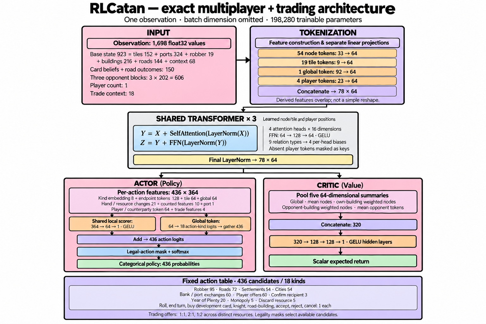

# RLCatan

Train and evaluate Catan agents with masked PPO, using
[Catanatron](https://github.com/bcollazo/catanatron) as the game engine.
Supports two to four players, approximate opponent card counting, and optional
player trading. Decisions use a single network pass without tree search.

## Install

Python 3.12+:

```sh
python3 -m venv .venv
.venv/bin/pip install -e .
```

## Train

```sh
.venv/bin/python -m rlcatan.training --output runs/new --seats --trading \
  --players 4 --target-vp 10 --max-turns 600 --max-actions 4000 \
  --steps 100000 --league builder planner --shaping .2 --skip-forced
.venv/bin/python -m rlcatan.benchmark --model runs/new --suite --pairs 100 --seed 9500000
```

Use a fresh output directory. `--resume runs/previous` continues training;
`--transfer runs/previous` initializes a compatible expanded representation.
`--player-counts 2 3 4 4` mixes game sizes. Opponents can be scripted players or
saved runs. The `rlcatan-train` and `rlcatan-benchmark` commands are equivalent.

## Architecture

Board, hand, public player state, and estimated opponent hands become structured
features. Separate projections turn intersections, tiles, players, and game
context into tokens. Three transformer blocks share information through four
attention heads, with board adjacency encoded as attention biases.

A shared scorer ranks complete candidate actions; illegal choices are masked.
A separate value branch estimates return for PPO. Training uses potential-based
reward shaping, randomized starting seats, and scripted/frozen-policy leagues.
The full trading configuration has 1,698 observation values, 78 tokens of width
64, 436 candidate actions, and 198,280 trainable parameters.



## Results

The saved trading checkpoint (`trade-c`) won **80.0%** against the mixed scripted
league, **64.25%** against builder, **43.0%** against planner, and **47.75%** against
Catanatron's value player in four-player games. Each matchup used 100 boards,
all four starting seats (400 games), a 10-point target, and limits of 600 turns
and 4,000 actions. No games reached those limits. The mixed-league 95% interval
was 75.25–84.5%, bootstrapped by board. These are checkpoint results, not a
performance guarantee for the short training example above.

[Recorded results and checkpoint hash](docs/results.json) include all two-,
three-, and four-player matchups. The mixed league samples greedy, builder,
expansion, and development opponents uniformly per seat.

## Checkpoints

Keep each `model.zip` beside its `run.json`, which records rules, seeds,
dependencies, and source hashes. Weights and training runs are not included in
this repository. Load only trusted checkpoints. Browser play is developed
separately in `RLCatan-play` and uses this package.

## History

The earlier notebook project is preserved on `legacy-rlmodels`.
